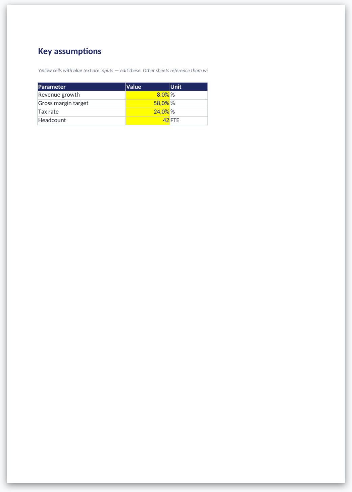
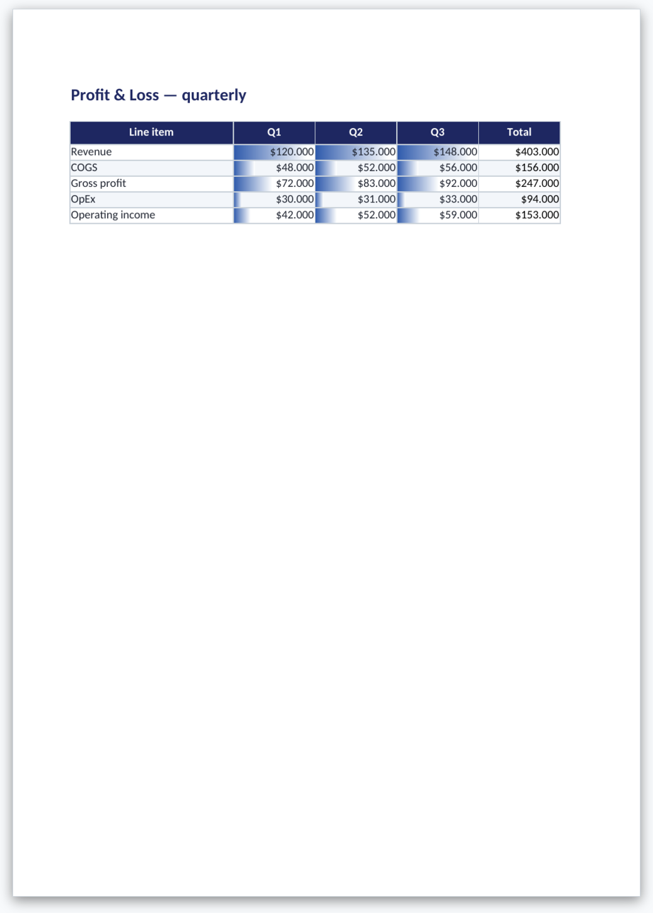
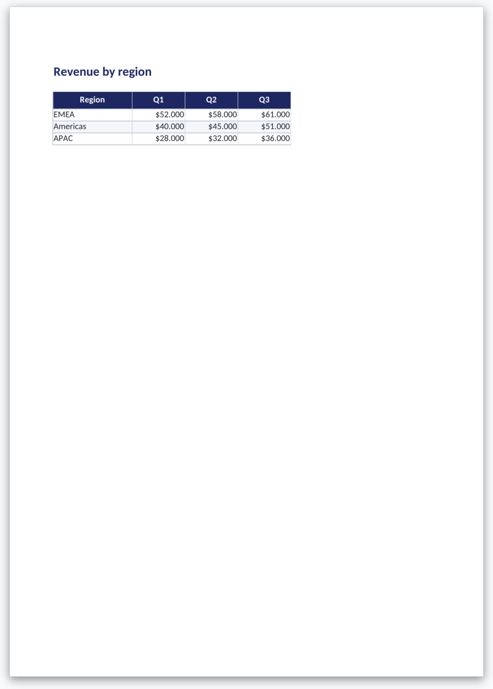
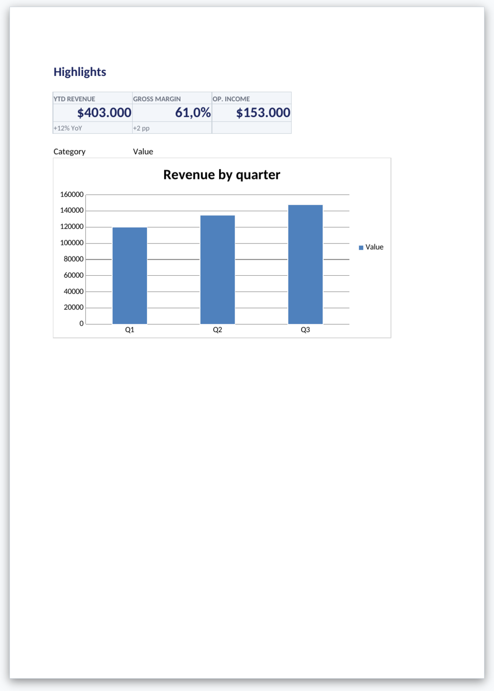

# Generate Spreadsheets — Native XLSX engine for Open WebUI

A [Open WebUI](https://github.com/open-webui/open-webui) **Tool** that generates
**native Excel (.xlsx)** workbooks from a JSON spec produced by the model.
It builds the file with `openpyxl`: multi-sheet workbooks, Excel Tables, live
formulas, freeze panes, filters, data validation, conditional formatting and
native charts.

The resulting file is saved through Open WebUI's **Files API** (with a `/cache/files`
fallback) and a clickable **download link** appears in the chat.

Formulas are written as native Excel strings. Excel (or LibreOffice) recalculates
them when you open the file. No LibreOffice is required inside the Open WebUI
container.

> License: MIT · Author: [IANUSTEC](https://ianustec.com)


*Workbook generated from [`examples/workbook.json`](examples/workbook.json) → [`examples/demo_budget.xlsx`](examples/demo_budget.xlsx).*

## Features

- **Native, editable .xlsx** (tables, formulas and charts open in Excel / LibreOffice / Google Sheets).
- **Multi-sheet workbooks** with tab colors from the accent theme.
- **Excel Tables** (`ListObject`) with row stripes, auto-filter and freeze panes.
- **Live formulas** on columns (`=SUM([{q1}]:[{q3}])`) and totals rows — not hardcoded Python results.
- **Typed columns**: text, number, currency, percent, date, integer, multiples.
- **Financial template**: blue input text, yellow fill, black formulas (Claude xlsx skill conventions).
- **Conditional formatting**: data bars, color scales, cell-value rules.
- **Data validation**: dropdown lists, min/max.
- **Native charts**: bar, stacked bar, line, area, pie, doughnut.
- **Sheet kinds**: `table`, `inputs`, `kpi_row`, `chart`, `matrix`, `notes`, `raw`, `mixed` (blocks).
- **Single-file**: one self-contained `.py`, paste into Workspace → Tools.

## Requirements

- Open WebUI `>= 0.4.0`
- Python: `openpyxl`, `pydantic` (declared in the frontmatter → installed automatically)

## Installation

### Option A — from the Open WebUI community
1. Open the tool page on the Open WebUI community site.
2. Click **Get** / **Import** to your instance.

### Option B — manual
1. In your Open WebUI instance go to **Workspace → Tools → +**.
2. Paste the contents of [`generate_spreadsheets.py`](generate_spreadsheets.py).
3. Save. Dependencies install on first use.
4. Enable the tool for the model (or chat) that should use it.

## Usage

The model calls `generate_spreadsheet(content)` with a **JSON string**. Minimal shape:

```json
{
  "title": "Q3 Budget Pack",
  "template": "financial",
  "theme": { "accent": "#1E2761" },
  "sheets": [
    {
      "name": "P&L",
      "kind": "table",
      "table": {
        "name": "PnL",
        "columns": [
          { "key": "line", "header": "Line item" },
          { "key": "q1", "header": "Q1", "format": "currency" },
          { "key": "q2", "header": "Q2", "format": "currency" },
          { "key": "total", "header": "Total", "format": "currency",
            "formula": "=SUM([{q1}]:[{q2}])" }
        ],
        "rows": [
          { "line": "Revenue", "q1": 120000, "q2": 135000 }
        ],
        "excel_table": true,
        "freeze": "A2"
      }
    }
  ]
}
```

Full example: [`examples/workbook.json`](examples/workbook.json).

### Templates
`financial` (default) · `blank` · `report` · `dashboard`.

### Formula tips
Prefer Excel-2007-era functions: `SUM`, `SUMIFS`, `INDEX`, `MATCH`, `IFERROR`, `SUMPRODUCT`.
Avoid `XLOOKUP`, `FILTER`, `UNIQUE`, `SEQUENCE` for maximum portability.

### Sheet / block kinds

| Kind | Main fields |
|---|---|
| `table` | `columns[]`, `rows[]`, `excel_table`, `freeze`, `totals_row`, `conditional_formatting`, `validation` |
| `inputs` | `items[]` with `{label, value, format, unit, comment}` |
| `kpi_row` | `stats[]` with `{label, value, change, format}` |
| `chart` | `chart_type`, `labels[]`, `values[]` or `datasets[]` |
| `matrix` | pivot-like static grid (`headers` / `columns` + `rows`) |
| `notes` | `title`, `text`, `level` (`info`\|`success`\|`warning`\|`danger`) |
| `raw` | sparse `cells[]` + `merges[]` |
| `mixed` | `blocks[]` of any kind above |

## Screenshots

| Assumptions (inputs) | P&L table |
|---|---|
|  |  |
| **By region** | **Charts + KPIs** |
|  |  |

## Valves

| Valve | Default | Description |
|---|---|---|
| `default_template` | `financial` | Template when the spec omits one |
| `xlsx_export_dir` | `/app/backend/data/cache/files` | Fallback save directory |
| `emit_status` | `true` | Status events in chat |
| `max_rows_per_sheet` | `5000` | Hard cap per table |

## How it works

1. The model produces the JSON spec and calls `generate_spreadsheet`.
2. The engine merges template defaults, creates sheets, and dispatches each kind.
3. Tables, formulas, charts and formatting are written as native OOXML.
4. The `.xlsx` is saved via the Files API (fallback `/cache/files` with an ASCII path) and the link is returned in chat.

## Local development / testing

```bash
pip install openpyxl pydantic
python examples/build.py   # → examples/demo_budget.xlsx
```

The `open_webui.*` imports are optional; the tool degrades to the cache-dir
fallback when they are missing.

## Contributing

Issues and PRs welcome. Keep the file **single-file** and free of mandatory
LibreOffice / network dependencies for core features.

## License

[MIT](LICENSE) © IANUSTEC
